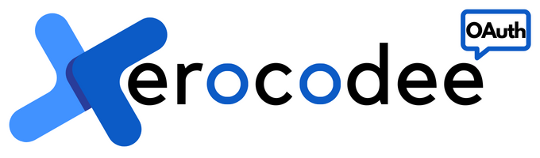

# XeroCodee 👋



## Readable & Production Ready Codee


---
[](https://xerocodee.slack.com/)
[](https://discord.gg/FTf9VD7pMB)
[](https://www.linkedin.com/company/xerocodee)
[](https://xerocodee.com/)
[](https://blog.xerocodee.com/)

---

There is XEROCODE if there is React/Typescript and a WebApp or MobileApp. If you only give it a try, you won't want to stop using it. The more websites you make, the more time you'll save.

---

## Advanced microservice-based OAuth system ( Goel )

To implement an advanced microservice-based OAuth system, you need to consider the following steps:

- Implement the authorization server

- Implement the resource server

- Implement the client application

- Implement the user authentication and authorization flow

- Integrate the components with a database

- Implement security measures

[more deatils](https://github.com/xerocodee/oauth/wiki)

---
### What stack is WeMakeDevs built on?

[](https://developer.mozilla.org/en-US/docs/Web/JavaScript)
[](https://docs.docker.com/)
[](https://kubernetes.io/docs/home/)
[](https://developer.mozilla.org/en-US/docs/Glossary/HTML5)
[](https://developer.mozilla.org/en-US/docs/Web/CSS)

### Quick Start
---

Install **XeroCodee OAuth** by running either of the following:

---

1 : Google Cloud Console setup

- Add Authorized Redirect URIs to be: <http://localhost:3000/auth/google> and  <http://localhost:3000/auth/google/callback>

- Google will generate unique Client ID and Client Secret keys for project. Create a new file called .env and add your keys and callback URL in there like so,

.env.example 

```shell 

CLIENT_ID=107xxx-ni31ps789mf1jd33nnfk57vdllhqcmie.apps.googleusercontent.com 
CLIENT_SECRET=KE5xxxvvm 
CALLBACK_URL=<http://localhost:3000/auth/google/callback>

```
2 : Start a Local Mongo DB

```shell
mongod
```
A local Mongo instance should start up on mongo://localhost:27017

---

Clone the repository with the following command:

```bash
git clone https://github.com/xerocodee/oauth
```

Run in terminal this command:

```bash
npm install
```

Then run this command to start your local server

```bash
npm start
```
---

# Contribute

We welcome contributions in our community.<br>
Before contributing,see <a href="https://github.com/xerocodee/oauth/blob/main/CONTRIBUTING.md">Contribution guide</a> for more information.

# License

This Community is <a href="https://github.com/xerocodee/oauth/blob/master/LICENSE">Licensed</a> under Mozilla Public License Version 2.0

